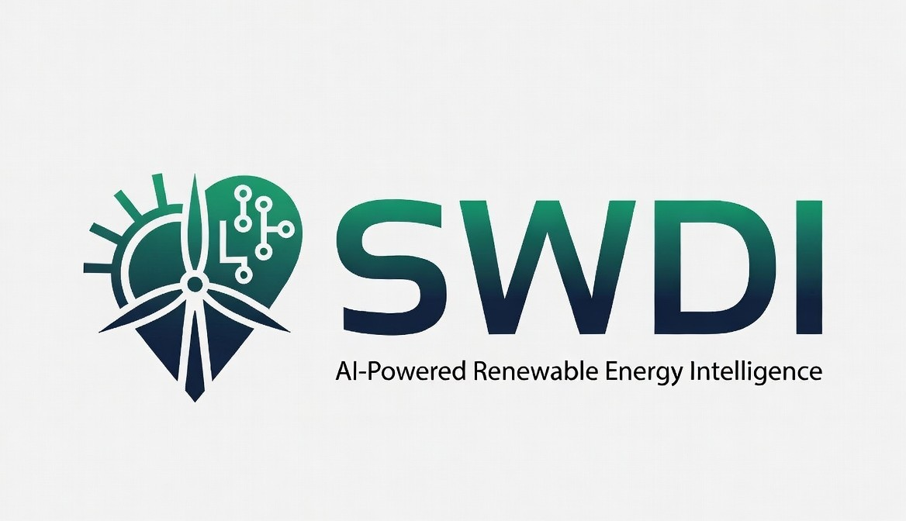

# <div align="center">



# 🌞 Solar & Wind Deployment Intelligence Platform

### AI-Powered Renewable Energy Intelligence Platform

*A scalable backend platform for intelligent solar and wind site assessment, renewable energy feature engineering, and AI-driven deployment analysis.*


---

### 🎓 Infosys Springboard Virtual Internship Project

**College Major Project**

Developed as part of the **Infosys Springboard Virtual Internship** to build an AI-powered renewable energy intelligence platform using modern backend technologies.

---

## 🚀 Current Project Status

| Item | Status |
|------|--------|
| Project Version | **v0.2.0** |
| Internship Progress | **Day 1 – Day 14 Completed** |
| Development Phase | Renewable Resource Intelligence |
| Backend Development | ✅ Completed |
| PostgreSQL Integration | ✅ Completed |
| SQLAlchemy ORM | ✅ Completed |
| REST APIs | ✅ Implemented |
| Feature Store | ✅ Implemented |
| Data Source Architecture | ✅ Implemented |
| Feature Engineering Foundation | ✅ Completed |
| NASA POWER Integration | ✅ Completed |
| Wind Assessment | ✅ Completed |
| Deployment Strategy Engine | ✅ Completed |
| Dataset Integration | 🚧 In Progress |
| Machine Learning Models | ⏳ Planned |
| Frontend Development | ⏳ Planned |
| Deployment | ⏳ Planned |

</div>

---

# 📖 Project Overview

The **Solar & Wind Deployment Intelligence Platform (SWDI)** is an AI-powered backend platform designed to support renewable energy planning through intelligent analysis of solar, wind, terrain, and infrastructure data.

The platform provides a modular architecture for collecting environmental datasets, generating renewable energy features, storing engineered features, and exposing them through REST APIs for future machine learning and decision-support systems.

The project follows a scalable software architecture using **FastAPI**, **PostgreSQL**, **SQLAlchemy**, and **Pydantic**, making it suitable for future integration with machine learning models, GIS datasets, and renewable energy prediction engines.

The platform now includes renewable resource intelligence capabilities through NASA POWER API integration, wind resource assessment, capacity factor estimation, and a rule-based deployment recommendation engine capable of recommending Solar, Wind, Hybrid, or Not Recommended deployment strategies.

This project is being developed incrementally as part of the **Infosys Springboard Virtual Internship** while following software engineering best practices, modular architecture, documentation standards, and version control.

---

# 🎯 Project Objectives

The primary objectives of this project are:

- Build a scalable FastAPI backend application.
- Design a modular software architecture.
- Integrate PostgreSQL for persistent data storage.
- Implement SQLAlchemy ORM models.
- Create reusable Pydantic validation schemas.
- Develop RESTful APIs for project and feature management.
- Build a Feature Store for renewable energy datasets.
- Design reusable Data Source Clients.
- Prepare the platform for AI-powered feature engineering.
- Integrate renewable energy data sources.
- Assess solar and wind resource quality.
- Recommend optimal renewable energy deployment strategies.
- Enable future machine learning model integration.
- Support renewable energy deployment analysis.
- Maintain professional software documentation.
- Follow industry-standard development practices.

---

# ❓ Problem Statement

Selecting an appropriate location for solar and wind energy deployment requires the analysis of multiple environmental, geographical, and infrastructural factors.

Traditional site evaluation often involves collecting data from multiple sources, manually processing datasets, and performing repetitive calculations. This process is time-consuming, difficult to scale, and prone to inconsistencies.

There is a need for a unified platform capable of:

- Managing renewable energy datasets.
- Engineering deployment features.
- Storing processed feature data.
- Providing standardized APIs.
- Supporting future AI-based deployment recommendations.

---

# 💡 Proposed Solution

The Solar & Wind Deployment Intelligence Platform addresses these challenges through a modular backend architecture that separates data acquisition, feature engineering, storage, and API services.

The platform is designed around four major layers:

- API Layer
- Service Layer
- Data Source Layer
- Database Layer

Each layer has a well-defined responsibility, improving maintainability, scalability, and future extensibility.

Future versions will integrate renewable energy datasets such as NASA POWER, Global Wind Atlas, SRTM, and OpenStreetMap to automatically generate deployment features and AI-powered recommendations.

---

# ✨ Key Features

## ✅ Implemented

### Backend Development

- FastAPI application
- Modular project architecture
- API routing
- Swagger documentation
- Health check endpoints
- About endpoint
- Spatial processing foundation: `app/utils/coordinates.py`, `app/spatial/*`, `app/services/spatial_analysis.py` (skeletons and unit tests)

### Database

- PostgreSQL integration
- SQLAlchemy ORM
- Automatic table generation
- Session management
- Project entity
- Feature entity

### REST APIs

- Project APIs
- Site APIs
- Feature retrieval APIs
- Request validation
- Response serialization

### Data Validation

- Pydantic schemas
- Request validation
- Response models
- ORM compatibility

### Data Source Layer

- NASA POWER client interface
- Global Wind Atlas client interface
- SRTM client interface
- OpenStreetMap client interface
- Feature Builder integration point

### Feature Store

- Feature SQLAlchemy model
- Feature database table
- FeatureCreate schema
- FeatureResponse schema
- FeatureStoreService
- Feature retrieval APIs
- Search by geographic location

### Renewable Resource Intelligence

- NASA POWER API Integration
- Solar Feature Extraction
- Wind Assessment
- Wind Classification
- Capacity Factor Estimation
- Deployment Recommendation
- Confidence Scoring
- Recommendation Reason Generation

### Documentation

- Weekly development reports
- Architecture documentation
- Database design
- Installation guides
- API documentation
- Changelog
- README

---

## 🚧 In Progress

- Feature Engineering Pipeline
- Dataset Integration Layer

---

## ⏳ Planned

- Machine Learning Models
- Prediction APIs
- Interactive Dashboard
- GIS Visualization
- Authentication & Authorization
- Docker Deployment
- Cloud Deployment
- CI/CD Pipeline

---

# 🛠 Technology Stack

## Programming Language

| Technology | Version |
|------------|----------|
| Python | 3.14.0 |

---

## Backend Framework

| Technology | Version |
|------------|----------|
| FastAPI | 0.139.0 |
| Uvicorn | 0.50.2 |
| Starlette | 0.47.1 |

---

## Database

| Technology | Version |
|------------|----------|
| PostgreSQL | 18 |
| SQLAlchemy | 2.0.51 |
| psycopg2-binary | 2.9.12 |

---

## Data Validation

| Technology | Version |
|------------|----------|
| Pydantic | 2.13.4 |

---

## Development Tools

| Tool |
|------|
| Visual Studio Code |
| PowerShell |
| Git |
| GitHub |
| PostgreSQL |
| Swagger UI |

---

## Version Control

- Git
- GitHub

---

## API Documentation

- OpenAPI 3.1
- Swagger UI

---

## Development Approach

The project follows:

- Modular Architecture
- Service-Oriented Design
- Layered Backend Architecture
- REST API Development
- ORM-Based Database Design
- Documentation-Driven Development
- Incremental Feature Development
- Version Control Best Practices

---

> **Next:** Part 2 – System Architecture, Backend Architecture, Folder Structure, Folder Description, and Project Workflow.


---

# 🏗 System Architecture

The Solar & Wind Deployment Intelligence Platform (SWDI) follows a layered and modular architecture that separates API handling, business logic, external data integration, spatial analysis, and persistent storage.

This architecture is designed for scalability, maintainability, and future integration with machine learning and GIS-based decision support systems.

                              +-------------------------+
                              |      Client / User      |
                              |  Browser / API Client   |
                              +-----------+-------------+
                                          |
                                          ▼
                              +-------------------------+
                              |       FastAPI API       |
                              |   REST API Endpoints    |
                              +-----------+-------------+
                                          |
                                          ▼
                              +-------------------------+
                              |      API Routers        |
                              +-----------+-------------+
                                          |
                                          ▼
                              +-------------------------+
                              |     Service Layer       |
                              +-----------+-------------+
                                          |
         ┌──────────────────────┬──────────┴──────────┬─────────────────────┐
         ▼                      ▼                     ▼                     ▼
 Solar Service          Wind Assessment     Deployment Strategy   Spatial Analysis
         │                      │                     │                     │
         └──────────────┬───────┴─────────────┬───────┘                     │
                        ▼                     ▼                             ▼
                NASA POWER API        Rule-Based Engine          Spatial Processing
                        │                                             │
                        └─────────────────────────────┬───────────────┘
                                                      ▼
                                            SQLAlchemy ORM
                                                      │
                                                      ▼
                                             PostgreSQL Database
---

# 🏛 Backend Architecture

The backend is developed using **FastAPI** and follows a clean layered architecture.

Client
   │
   ▼
FastAPI
   │
   ▼
API Routers
   │
   ▼
Business Services
   │
   ├───────────────────────────────────────────────┐
   ▼                                               ▼
Feature Store                              Renewable Intelligence
                                                   │
                     ┌──────────────┬──────────────┼───────────────┐
                     ▼              ▼              ▼               ▼
              Solar Service   Wind Assessment  Deployment   Spatial Analysis
                     │              │           Strategy
                     ▼              ▼              │
               NASA POWER      Wind Logic    Recommendation
                     │                             │
                     └──────────────┬──────────────┘
                                    ▼
                             SQLAlchemy ORM
                                    │
                                    ▼
                              PostgreSQL


---

## Architecture Layers

### 1. API Layer

Responsible for exposing REST APIs.

Current APIs:

- Home
- Health
- About
- Projects
- Sites
- Features

Responsibilities

- Accept HTTP requests
- Validate inputs
- Return JSON responses
- Connect with Services

---

### 2. Service Layer

Contains the business logic.

Current Services

- FeatureStoreService
- Feature Engineering Foundation

Responsibilities

- Coordinate business operations
- Query database
- Prepare responses
- Manage future dataset integration

---

### 3. Data Source Layer

Introduced during **Day 10**.

Responsible for communicating with external renewable energy datasets.

Current Client Interfaces

- NASA POWER
- Global Wind Atlas
- SRTM
- OpenStreetMap

Current Status

- Interface definitions completed
- Retrieval logic pending

---

### 4. Database Layer

Responsible for persistent storage.

Technology

- PostgreSQL
- SQLAlchemy ORM

Current Tables

- projects
- features

---

# 📂 Project Folder Structure

solar-wind-deployment-intelligence/
│
├── backend/
│   ├── app/
│   │
│   ├── api/
│   │   ├── home.py
│   │   ├── projects.py
│   │   ├── sites.py
│   │   ├── features.py
│   │   └── solar.py
│   │
│   ├── data_sources/
│   │   ├── nasa_power.py
│   │   ├── global_wind_atlas.py
│   │   ├── srtm.py
│   │   ├── osm.py
│   │   └── __init__.py
│   │
│   ├── database/
│   │   └── database.py
│   │
│   ├── models/
│   │   ├── project.py
│   │   └── feature.py
│   │
│   ├── schemas/
│   │   ├── project.py
│   │   └── feature.py
│   │
│   ├── services/
│   │   ├── feature_store.py
│   │   ├── solar_service.py
│   │   ├── spatial_analysis.py
│   │   ├── wind_assessment.py
│   │   └── deployment_strategy.py
│   │
│   ├── spatial/
│   │   ├── raster_processor.py
│   │   └── vector_processor.py
│   │
│   ├── utils/
│   │   └── coordinates.py
│   │
│   └── main.py
│
├── datasets/
│
├── docs/
│
├── reports/
│
├── README.md
├── CHANGELOG.md
├── LICENSE
└── requirements.txt
---

# 📁 Folder Description

| Folder                     | Description                                                                                    |
| -------------------------- | ---------------------------------------------------------------------------------------------- |
| `backend/app/api`          | FastAPI REST API endpoints                                                                     |
| `backend/app/services`     | Business logic, renewable energy intelligence, and deployment decision services                |
| `backend/app/data_sources` | External renewable energy dataset clients (NASA POWER, Global Wind Atlas, SRTM, OpenStreetMap) |
| `backend/app/models`       | SQLAlchemy ORM models                                                                          |
| `backend/app/schemas`      | Pydantic request and response schemas                                                          |
| `backend/app/database`     | Database connection and session management                                                     |
| `backend/app/spatial`      | Raster and vector spatial processing components                                                |
| `backend/app/utils`        | Shared utility functions such as coordinate validation and transformations                     |
| `datasets`                 | Renewable energy datasets for future processing                                                |
| `docs`                     | Architecture, API documentation, setup guides, and project reports                             |
| `reports`                  | Generated reports and analysis outputs                                                         |


---

# 🔄 Project Workflow


                    User Request
                         │
                         ▼
                 FastAPI Endpoint
                         │
                         ▼
                    API Router
                         │
                         ▼
                  Business Service
                         │
      ┌──────────────────┼──────────────────────┐
      ▼                  ▼                      ▼
 Solar Service    Wind Assessment      Spatial Analysis
      │                  │                      │
      ▼                  ▼                      ▼
 NASA POWER      Wind Classification    Coordinate Processing
      │                  │                      │
      ▼                  ▼                      ▼
 Feature Extraction  Capacity Factor     Spatial Features
      │                  │                      │
      └──────────────┬───┴──────────────┬───────┘
                     ▼                  ▼
             Deployment Strategy Service
                     │
                     ▼
         Recommendation + Confidence +
               Decision Explanation
                     │
                     ▼
              SQLAlchemy ORM
                     │
                     ▼
             PostgreSQL Database
                     │
                     ▼
               JSON API Response

---

# ⚙ Request Processing Flow

Every request follows a structured lifecycle, ensuring proper validation, processing, business logic execution, and response generation.


                     Client Request
                           │
                           ▼
                     FastAPI Endpoint
                           │
                           ▼
                      API Router
                           │
                           ▼
               Pydantic Request Validation
                           │
                           ▼
                    Business Service
                           │
       ┌───────────────────┼────────────────────┐
       ▼                   ▼                    ▼
 Solar Service     Wind Assessment     Spatial Analysis
       │                   │                    │
       ▼                   ▼                    ▼
 NASA POWER API    Wind Classification  Coordinate Processing
       │                   │                    │
       ▼                   ▼                    ▼
 Solar Features   Capacity Factor      Spatial Features
       │                   │                    │
       └──────────────┬────┴─────────────┬──────┘
                      ▼                  ▼
            Deployment Strategy Service
                      │
                      ▼
     Recommendation + Confidence + Reason
                      │
                      ▼
                SQLAlchemy ORM
                      │
                      ▼
             PostgreSQL Database
                      │
                      ▼
               JSON API Response

---

# 🎯 Design Principles 

The project is designed using modern backend software engineering practices to ensure scalability, maintainability, and future AI integration.

# ----- Principles-----

Layered Architecture
Modular Design
Separation of Concerns
Service-Oriented Architecture
Reusable Business Logic
RESTful API Design
Database Abstraction using SQLAlchemy ORM
Pydantic-Based Data Validation
External Data Source Abstraction
Spatial Processing Foundation
Rule-Based Decision Engine
Clean Code Practices
Documentation-Driven Development
Incremental Feature Development
Version Control Best Practices

# -----Design Goals-----

Build reusable and maintainable backend services.
Isolate business logic from API routes.
Simplify integration with external renewable energy datasets.
Support future machine learning and GIS modules.
Enable scalable deployment recommendation workflows.
Maintain professional project documentation throughout development.

---

# 📌 Current Architecture Status

| Component                         | Status      |
| --------------------------------- | ----------- |
| FastAPI Backend                   | ✅ Completed |
| Modular API Routing               | ✅ Completed |
| PostgreSQL Integration            | ✅ Completed |
| SQLAlchemy ORM                    | ✅ Completed |
| Pydantic Validation               | ✅ Completed |
| Project Management APIs           | ✅ Completed |
| Feature Store                     | ✅ Completed |
| Data Source Layer                 | ✅ Completed |
| NASA POWER API Integration        | ✅ Completed |
| Solar Feature Extraction          | ✅ Completed |
| Spatial Processing Foundation     | ✅ Completed |
| Wind Assessment Service           | ✅ Completed |
| Wind Classification               | ✅ Completed |
| Capacity Factor Estimation        | ✅ Completed |
| Deployment Strategy Engine        | ✅ Completed |
| Recommendation Confidence Scoring | ✅ Completed |
| Decision Explanation Generation   | ✅ Completed |
| Manual Testing & Validation       | ✅ Completed |
| Global Wind Atlas Integration     | ⏳ Planned   |
| SRTM Data Integration             | ⏳ Planned   |
| OpenStreetMap Integration         | ⏳ Planned   |
| Automated Feature Engineering     | ⏳ Planned   |
| Machine Learning Models           | ⏳ Planned   |
| Prediction APIs                   | ⏳ Planned   |
| Frontend Dashboard                | ⏳ Planned   |
| Cloud Deployment                  | ⏳ Planned   |


---

> **Next:** Part 3 – Database Design, Database Schema, REST API Reference, Feature Store, Data Source Layer, and API Documentation.


---

# 🗄 Database Design

The Solar & Wind Deployment Intelligence Platform (SWDI) uses PostgreSQL as its primary relational database and SQLAlchemy ORM for object-relational mapping.

The database is designed to support renewable energy project management, engineered feature storage, and future AI-based deployment analysis.

# -----Database Objectives -----

Store renewable energy project information
Persist engineered environmental features
Support efficient feature retrieval
Enable integration with external renewable energy datasets
Provide a scalable foundation for machine learning workflows
Property	Value
Database	PostgreSQL
Version	18
ORM	SQLAlchemy 2.0
Driver	psycopg2-binary
Status	✅ Connected
---

# 🏛 Database Architecture

```
                   FastAPI
                      │
                      ▼
              SQLAlchemy ORM
                      │
                      ▼
             PostgreSQL Database
                      │
          ┌───────────┴───────────┐
          ▼                       ▼
     Projects Table         Features Table
```

---

# 📊 Database Schema

The platform currently contains two primary database entities.

| Table    | Purpose                                     | Status |
| -------- | ------------------------------------------- | ------ |
| Projects | Stores renewable energy project information | ✅      |
| Features | Stores engineered renewable energy features | ✅      |


---

# 📋 Projects Table

The **Projects** table stores user-defined renewable energy project locations.

## Fields

| Column       | Type      | Description         |
| ------------ | --------- | ------------------- |
| id           | Integer   | Primary Key         |
| project_name | String    | Project name        |
| description  | String    | Project description |
| state        | String    | State               |
| latitude     | Float     | Latitude            |
| longitude    | Float     | Longitude           |
| created_at   | Timestamp | Creation timestamp  |


---

## Purpose

The Projects table serves as the entry point for renewable energy site analysis.

Each project represents a potential deployment location that can later be enriched with environmental features.

---

# 📋 Features Table

The **Features** table stores engineered renewable energy features generated for a geographic location.

## Fields

| Column           | Type      | Description        |
| ---------------- | --------- | ------------------ |
| id               | Integer   | Primary Key        |
| latitude         | Float     | Latitude           |
| longitude        | Float     | Longitude          |
| solar_irradiance | Float     | Solar irradiance   |
| wind_speed       | Float     | Wind speed         |
| temperature      | Float     | Temperature        |
| humidity         | Float     | Relative humidity  |
| elevation        | Float     | Elevation          |
| slope            | Float     | Terrain slope      |
| created_at       | Timestamp | Creation timestamp |


---

## Current Status

✅ SQLAlchemy ORM Models
✅ PostgreSQL Tables
✅ Automatic Table Creation
✅ Feature Storage
✅ Project Storage
✅ REST API Integration

---

# 🔗 Entity Relationship

```text
Projects
──────────────
id
project_name
description
state
latitude
longitude
created_at

         │
         │ (Future Relationship)
         ▼

Features
──────────────
id
latitude
longitude
solar_irradiance
wind_speed
temperature
humidity
elevation
slope
created_at
```

---

# 🧩 Feature Store

## Overview

The Feature Store is responsible for storing processed renewable energy features for future analysis and prediction.

Instead of repeatedly collecting environmental data from external datasets, the Feature Store enables efficient storage and retrieval of generated features.

---

## Current Implementation

### SQLAlchemy Model

SQLAlchemy Model

Implemented:

Feature ORM Model
PostgreSQL Integration
Automatic Timestamp
Database Mapping

---

### Pydantic Schemas

Implemented:

FeatureCreate
FeatureResponse

Purpose:

Request Validation
Response Serialization
ORM Compatibility

---

### Feature Store Service

| Method                    | Purpose                  |
| ------------------------- | ------------------------ |
| create_feature()          | Store feature records    |
| get_all_features()        | Retrieve all features    |
| get_feature_by_location() | Search using coordinates |


---

### Current APIs

| Endpoint | Method | Status |
|-----------|--------|--------|
| /features | GET | ✅ |
| /features/{id} | GET | ✅ |

---

# 🌍 Data Source Layer

## Overview

The platform follows a modular data source architecture where each external dataset is encapsulated within its own client.

This design allows datasets to be replaced or extended without affecting the service layer.

---

## Current Data Source Clients

| Dataset           | Purpose                                | Status       |
| ----------------- | -------------------------------------- | ------------ |
| NASA POWER        | Solar radiation, temperature, humidity | ✅ Integrated |
| Global Wind Atlas | Wind resource data                     | 🚧 Planned   |
| SRTM              | Elevation data                         | 🚧 Planned   |
| OpenStreetMap     | Infrastructure data                    | 🚧 Planned   |


---

## Current Architecture

                Renewable Intelligence
                         │
                         ▼
                Data Source Clients
        ┌────────┬─────────┬────────┬─────────┐
        ▼        ▼         ▼        ▼
 NASA POWER    GWA       SRTM      OSM
        │
        ▼
 Solar Feature Extraction
        │
        ▼
 Feature Store
        │
        ▼
 PostgreSQL

---

## Current Development Status

| Component                   | Status       |
| --------------------------- | ------------ |
| NASA POWER Client           | ✅ Integrated |
| Solar Feature Service       | ✅ Completed  |
| Wind Assessment Service     | ✅ Completed  |
| Deployment Strategy Service | ✅ Completed  |
| Global Wind Atlas           | ⏳ Planned    |
| SRTM Integration            | ⏳ Planned    |
| OpenStreetMap Integration   | ⏳ Planned    |


---

# 🌐 REST API Reference

The backend exposes RESTful APIs using FastAPI.

All APIs are documented automatically using Swagger (OpenAPI 3.1).

---

## API Summary

| Method | Endpoint        | Description                      |
| ------ | --------------- | -------------------------------- |
| GET    | /               | Home Endpoint                    |
| GET    | /health         | Health Check                     |
| GET    | /about          | Project Information              |
| GET    | /projects       | Retrieve Projects                |
| POST   | /projects       | Create Project                   |
| GET    | /sites          | Retrieve Sites                   |
| GET    | /features       | Retrieve All Features            |
| GET    | /features/{id}  | Retrieve Feature by ID           |
| GET    | /solar/features | Retrieve Solar Resource Features |


---

## API Statistics

| Metric      | Value |
| ----------- | ----- |
| Total APIs  | 9     |
| GET APIs    | 8     |
| POST APIs   | 1     |
| PUT APIs    | 0     |
| DELETE APIs | 0     |


---

# 📖 Swagger Documentation

FastAPI automatically generates interactive API documentation.

Current Documentation

- OpenAPI 3.1
- Swagger UI
- Request Schemas
- Response Schemas
- Validation Models

Access Swagger:

```text
http://127.0.0.1:8000/docs
```

Access OpenAPI JSON:

```text
http://127.0.0.1:8000/openapi.json
```

---

# ✅ Current Backend Capability

The backend can currently:

Manage renewable energy projects
Store engineered renewable energy features
Retrieve renewable energy feature records
Integrate NASA POWER solar resource data
Perform wind resource assessment
Classify wind potential
Estimate wind capacity factors
Recommend Solar, Wind, or Hybrid deployments
Generate confidence scores and recommendation explanations
Expose RESTful APIs
Generate OpenAPI and Swagger documentation
---

> **Next:** Part 4 – Installation Guide, Development Environment, Configuration, Verification & Testing, Git Workflow, and Development Workflow.


---

# 💻 Development Environment

The project is developed using modern Python backend technologies with a modular architecture and PostgreSQL as the primary database.

## Operating System

| Component         | Details            |
| ----------------- | ------------------ |
| Operating System  | Windows 11         |
| Development Shell | PowerShell         |
| IDE               | Visual Studio Code |
| Version Control   | Git & GitHub       |

---

## Programming Language

| Technology | Version |
| ---------- | ------- |
| Python     | 3.14.0  |


---

## Backend Framework

| Technology | Version |
| ---------- | ------- |
| FastAPI    | 0.139.0 |
| Uvicorn    | 0.50.2  |
| SQLAlchemy | 2.0.51  |
| Pydantic   | 2.13.4  |


---

## Database

| Technology      | Version |
| --------------- | ------- |
| PostgreSQL      | 18      |
| psycopg2-binary | 2.9.12  |


---

## Data Validation

| Technology | Version |
|------------|----------|
| Pydantic | 2.13.4 |

---

# 📦 Project Dependencies

Current project dependencies:

```text
annotated-doc==0.0.4
annotated-types==0.7.0
anyio==4.14.1
click==8.4.2
colorama==0.4.6
fastapi==0.139.0
greenlet==3.5.3
h11==0.16.0
idna==3.18
psycopg2-binary==2.9.12
pydantic==2.13.4
pydantic_core==2.46.4
SQLAlchemy==2.0.51
starlette==1.3.1
typing-inspection==0.4.2
typing_extensions==4.16.0
uvicorn==0.50.2
```

---

# ⚙ Prerequisites

Before running the project, ensure the following software is installed.

| Software           | Required |
| ------------------ | -------- |
| Python 3.14+       | ✅        |
| PostgreSQL 18      | ✅        |
| Git                | ✅        |
| Visual Studio Code | ✅        |


---

# 🚀 Installation Guide

## 1. Clone the Repository

```bash
git clone https://github.com/ganjivenkatesh0/solar-wind-deployment-intelligence.git

cd solar-wind-deployment-intelligence
```

---

## 2. Create Virtual Environment

Windows

```bash
python -m venv .venv
```

---

## 3. Activate Virtual Environment

PowerShell

```powershell
.venv\Scripts\activate
```

---

## 4. Install Dependencies

```bash
pip install -r requirements.txt
```

---

## 5. Configure PostgreSQL

Create a PostgreSQL database.

Example

```text
Database Name

solar_wind_db
```

Configure the database connection in:

```text
backend/app/database/database.py
```

---

## 6. Run the Backend

```bash
uvicorn backend.app.main:app --reload
```

Expected output

```text
INFO: Uvicorn running on http://127.0.0.1:8000
```

---

# 🌐 API Documentation

Once the backend starts successfully:

Swagger UI

```text
http://127.0.0.1:8000/docs
```

OpenAPI Specification

```text
http://127.0.0.1:8000/openapi.json
```

---

# 🧪 Verification Guide

## Verify Backend

```bash
uvicorn backend.app.main:app --reload
```

Expected

- Backend starts successfully
- No import errors
- No SQLAlchemy errors
- No FastAPI errors

---

## Verify Database

Open PostgreSQL

```bash
psql -U postgres -d solar_wind_db
```


🗂 List Tables

Connect to PostgreSQL:

psql -U postgres -d solar_wind_db

List all tables:

\dt

Expected output:

              List of relations
 Schema |   Name    | Type  |  Owner
--------+-----------+-------+----------
 public | features  | table | postgres
 public | projects  | table | postgres

Status: ✅ Successfully Verified


📋 Verify Features Table

Display the table structure:

\d features

Expected columns:

| Column           | Type             | Description          |
| ---------------- | ---------------- | -------------------- |
| id               | Integer          | Primary Key          |
| latitude         | Double Precision | Latitude             |
| longitude        | Double Precision | Longitude            |
| solar_irradiance | Double Precision | Solar irradiance     |
| wind_speed       | Double Precision | Wind speed           |
| temperature      | Double Precision | Temperature          |
| humidity         | Double Precision | Relative humidity    |
| elevation        | Double Precision | Elevation            |
| slope            | Double Precision | Terrain slope        |
| created_at       | Timestamp        | Record creation time |


Verification Status:

✅ Table Created
✅ ORM Mapping Verified
✅ Feature Storage Ready


📋 Verify Projects Table

Display the table structure:

\d projects

Expected columns:

| Column       | Type              | Description          |
| ------------ | ----------------- | -------------------- |
| id           | Integer           | Primary Key          |
| project_name | Character Varying | Project name         |
| description  | Character Varying | Project description  |
| state        | Character Varying | State                |
| latitude     | Double Precision  | Latitude             |
| longitude    | Double Precision  | Longitude            |
| created_at   | Timestamp         | Record creation time |


Verification Status:

✅ Table Created
✅ ORM Mapping Verified
✅ CRUD Operations Verified
✅ Database Verification Summary

| Verification Item        | Status     |
| ------------------------ | ---------- |
| PostgreSQL Connection    | ✅ Verified |
| Projects Table           | ✅ Verified |
| Features Table           | ✅ Verified |
| SQLAlchemy ORM Mapping   | ✅ Verified |
| Automatic Table Creation | ✅ Verified |
| CRUD Operations          | ✅ Verified |
| Feature Storage          | ✅ Verified |


---

# 🔍 API Verification

Current implemented endpoints

| Endpoint        | Method   | Status |
| --------------- | -------- | ------ |
| /               | GET      | ✅      |
| /health         | GET      | ✅      |
| /about          | GET      | ✅      |
| /projects       | GET/POST | ✅      |
| /sites          | GET      | ✅      |
| /features       | GET      | ✅      |
| /features/{id}  | GET      | ✅      |
| /solar/features | GET      | ✅      |


---

🔍 Feature Verification
Verify Feature Retrieval API

Retrieve all stored renewable energy features.

Request

GET /features

Expected Response

[
  {
    "id": 1,
    "latitude": 17.3850,
    "longitude": 78.4867,
    "solar_irradiance": 4.1518,
    "wind_speed": 6.2,
    "temperature": 20.4,
    "humidity": 65.44,
    "elevation": 520,
    "slope": 3.5
  }
]
Verify Feature by ID

Request

GET /features/1

Expected Response

{
  "id": 1,
  "latitude": 17.3850,
  "longitude": 78.4867,
  "solar_irradiance": 4.1518,
  "wind_speed": 6.2,
  "temperature": 20.4,
  "humidity": 65.44,
  "elevation": 520,
  "slope": 3.5
}

If no record exists:

{
  "detail": "Feature not found"
}
Verify Solar Feature Extraction

Request

GET /solar/features?latitude=17.3850&longitude=78.4867

Expected Response

{
  "solar_irradiance": 4.1518,
  "temperature": 20.4,
  "relative_humidity": 65.44
}
Verify Wind Assessment

Sample verification:

service.classify_wind_site(6.2)

Expected Output

{
    "wind_speed": 6.2,
    "classification": "Good",
    "capacity_factor": 45
}
Verify Deployment Strategy

Sample verification:

service.recommend_deployment(
    "Excellent",
    "Good"
)

Expected Output

| Feature                          | Status     |
| -------------------------------- | ---------- |
| Feature Store                    | ✅ Verified |
| Feature Retrieval API            | ✅ Verified |
| Feature Search by Location       | ✅ Verified |
| NASA POWER Integration           | ✅ Verified |
| Solar Feature Extraction         | ✅ Verified |
| Wind Classification              | ✅ Verified |
| Capacity Factor Estimation       | ✅ Verified |
| Deployment Recommendation        | ✅ Verified |
| Confidence Score Generation      | ✅ Verified |
| Recommendation Reason Generation | ✅ Verified |
| Manual API Testing               | ✅ Verified |


# -----Functional Testing Completed-------
| Test                             | Status |
| -------------------------------- | ------ |
| FastAPI Startup                  | ✅      |
| PostgreSQL Connection            | ✅      |
| Project APIs                     | ✅      |
| Feature APIs                     | ✅      |
| NASA POWER API Integration       | ✅      |
| Solar Feature Extraction         | ✅      |
| Wind Classification              | ✅      |
| Capacity Factor Calculation      | ✅      |
| Deployment Strategy              | ✅      |
| Confidence Score Generation      | ✅      |
| Recommendation Reason Generation | ✅      |

# Boundary Testing

Completed for:

Wind Classification
Capacity Factor Calculation

# Testing Summary
Category	Status
API Integration Testing	✅
Functional Testing	✅
Boundary Testing	✅
Manual Validation	✅

---

# 📖 Documentation Structure

Project documentation is organized as follows.

docs/
├── api_docs/
├── architecture/
├── database_design/
├── setup/
├── testing/
├── weekly_notes/
└── PROJECT_REPORT.md

---

📚 Current Documentation

| Document                             | Status               |
| ------------------------------------ | -------------------- |
| README.md                            | ✅ Updated (Day 1–14) |
| PROJECT_REPORT.md                    | ✅ Updated            |
| CHANGELOG.md                         | ✅ Maintained         |
| Weekly Development Notes (Day 1–14)  | ✅ Completed          |
| System Architecture Documentation    | ✅ Completed          |
| Backend Architecture Documentation   | ✅ Completed          |
| Database Design Documentation        | ✅ Completed          |
| REST API Documentation               | ✅ Completed          |
| Installation & Setup Guide           | ✅ Completed          |
| Development Environment Guide        | ✅ Completed          |
| Verification & Testing Documentation | ✅ Completed          |
| Git Workflow Documentation           | ✅ Completed          |
| Development Workflow Documentation   | ✅ Completed          |


---

# 🌳 Git Workflow

Clone

```bash
git clone <repository-url>
```

Create Feature

```bash
git checkout -b feature/new-feature
```

Commit

```bash
git add .

git commit -m "feat: implement new feature"
```

Push

```bash
git push origin feature/new-feature
```

Merge

```bash
git checkout main

git merge feature/new-feature
```

---

# 🔄 Development Workflow

Requirement Analysis
         │
         ▼
Project Planning
         │
         ▼
Architecture Design
         │
         ▼
Implementation
         │
         ▼
Integration
         │
         ▼
Testing & Verification
         │
         ▼
Documentation
         │
         ▼
Git Commit
         │
         ▼
GitHub Push
         │
         ▼
Version Release

---

# 📌 Coding Standards

The project follows the following principles:

Modular Architecture
Layered Design
REST API Best Practices
Service-Oriented Development
SQLAlchemy ORM Standards
Pydantic Validation
Clean Code Principles
PEP 8 Style Guide
Documentation-Driven Development
Git Version Control
Incremental Feature Development

---

# 🛡 Quality Assurance

Every completed task is verified using:

FastAPI endpoint verification
PostgreSQL database validation
SQLAlchemy ORM verification
NASA POWER API integration testing
Wind assessment testing
Capacity factor validation
Deployment strategy verification
Boundary value testing
Manual API testing using Swagger UI
Git version tracking
README and project report updates

This ensures each development milestone is validated before moving to the next implementation phase.

---

> **Next:** Part 5 – Internship Progress (Day 1–14), Features Implemented Summary, Current Backend Status, Project Roadmap, Future Enhancements, Learning Outcomes, Author, License, Acknowledgements, and Repository Status.


---

# 📅 Internship Progress

This project is being developed as part of the Infosys Springboard Virtual Internship. The development follows an incremental software engineering approach, where each day introduces new backend capabilities, renewable energy intelligence features, and supporting documentation.

## Progress Timeline

| Day    | Module                                                    | Status      |
| ------ | --------------------------------------------------------- | ----------- |
| Day 1  | Development Environment & Project Initialization          | ✅ Completed |
| Day 2  | Project Planning & Documentation                          | ✅ Completed |
| Day 3  | Backend Architecture & Routing Foundation                 | ✅ Completed |
| Day 4  | Database Design & System Architecture                     | ✅ Completed |
| Day 5  | FastAPI Backend & REST APIs                               | ✅ Completed |
| Day 6  | Modular API Routing & Backend Refactoring                 | ✅ Completed |
| Day 7  | PostgreSQL Integration & SQLAlchemy ORM                   | ✅ Completed |
| Day 8  | Project CRUD APIs & Database Validation                   | ✅ Completed |
| Day 9  | Project Verification, Documentation & GitHub Setup        | ✅ Completed |
| Day 10 | Data Source Architecture & Feature Engineering Foundation | ✅ Completed |
| Day 11 | Feature Store & Feature Management APIs                   | ✅ Completed |
| Day 12 | Spatial Processing Foundation                             | ✅ Completed |
| Day 13 | NASA POWER API Integration & Solar Feature Extraction     | ✅ Completed |
| Day 14 | Wind Assessment & Deployment Strategy Engine              | ✅ Completed |


---
For **v0.2.0 (Day 1–14)**, replace your **Current Project Capabilities** section with the following:

---

# 🚀 Current Project Capabilities

The **Solar & Wind Deployment Intelligence Platform** currently provides a robust backend for renewable energy data management, feature engineering, and deployment recommendation. The system integrates external environmental data sources and exposes RESTful APIs for renewable energy analysis.

## 🌐 Backend Services

* ✅ FastAPI REST Backend
* ✅ Modular Service-Oriented Architecture
* ✅ PostgreSQL Database Integration
* ✅ SQLAlchemy ORM
* ✅ Pydantic Data Validation
* ✅ Interactive Swagger/OpenAPI Documentation

---

## 📂 Project Management

* ✅ Create Renewable Energy Projects
* ✅ Retrieve Project Information
* ✅ PostgreSQL Data Persistence
* ✅ Database Validation

---

## 🧩 Feature Store

* ✅ Store Renewable Energy Features
* ✅ Retrieve All Feature Records
* ✅ Retrieve Features by ID
* ✅ Geographic Feature Management
* ✅ Feature Storage in PostgreSQL

---

## 🌍 Renewable Data Integration

* ✅ NASA POWER API Integration
* ✅ Solar Irradiance Retrieval
* ✅ Temperature Retrieval
* ✅ Relative Humidity Retrieval

---

## ☀️ Feature Engineering

* ✅ Solar Feature Extraction
* ✅ Wind Resource Assessment
* ✅ Wind Classification
* ✅ Capacity Factor Estimation
* ✅ Renewable Resource Processing

---

## 📍 Spatial Processing

* ✅ Coordinate Utilities
* ✅ Raster Processing Foundation
* ✅ Vector Processing Foundation
* ✅ Spatial Analysis Service

---

## 🧠 Deployment Intelligence

* ✅ Solar Suitability Assessment
* ✅ Wind Suitability Assessment
* ✅ Hybrid Deployment Recommendation
* ✅ Confidence Score Generation
* ✅ Recommendation Reason Generation

---

## 🌐 REST API Services

* ✅ Project Management APIs
* ✅ Feature Management APIs
* ✅ Solar Feature APIs
* ✅ Health Check API
* ✅ API Documentation (Swagger/OpenAPI)

---

## ✅ Testing & Verification

* ✅ Database Verification
* ✅ CRUD Operation Testing
* ✅ REST API Testing
* ✅ NASA POWER Integration Testing
* ✅ Wind Assessment Testing
* ✅ Deployment Strategy Validation
* ✅ Boundary Value Testing
* ✅ Manual Functional Testing

---

## 📈 Current Development Status

| Module                        | Status      |
| ----------------------------- | ----------- |
| Backend Development           | ✅ Completed |
| Database Integration          | ✅ Completed |
| REST API Development          | ✅ Completed |
| Feature Store                 | ✅ Completed |
| Feature Engineering           | ✅ Completed |
| NASA POWER Integration        | ✅ Completed |
| Wind Assessment               | ✅ Completed |
| Deployment Strategy Engine    | ✅ Completed |
| Spatial Processing Foundation | ✅ Completed |
| Documentation                 | ✅ Completed |
| Testing & Verification        | ✅ Completed |


---

# 🛣 Project Roadmap

## Phase 1 — Backend Foundation ✅

- Development Environment
- FastAPI
- PostgreSQL
- SQLAlchemy
- Pydantic
- CRUD APIs
- Feature Store
- Documentation

Status

**Completed**

---

## Phase 2 — Data Engineering 🚧

- Dataset Integration
- NASA POWER
- Global Wind Atlas
- SRTM
- OpenStreetMap
- Feature Engineering
- Automated Feature Generation

Status

**Completed**

- Data Source Architecture
- NASA POWER Integration
- Solar Feature Extraction
- Wind Assessment
- Deployment Strategy

Remaining

- Global Wind Atlas Integration
- SRTM Integration
- OpenStreetMap Integration
- Automated Feature Engineering

---

## Phase 3 — Artificial Intelligence ⏳

Planned

- Machine Learning
- Model Training
- Prediction Engine
- Recommendation System
- Site Scoring

---

## Phase 4 — Frontend Development ⏳

Planned

- React Frontend
- Interactive Dashboard
- GIS Visualization
- Charts
- Maps

---

## Phase 5 — Deployment ⏳

Planned

- Docker
- Cloud Deployment
- CI/CD
- Production Hosting

---

# 🔮 Future Enhancements

The following enhancements are planned in future versions.

## Backend

- Authentication
- Authorization
- User Management
- API Versioning
- Logging
- Exception Handling

---

## Machine Learning

- Solar Prediction Model
- Wind Prediction Model
- Site Suitability Model
- Recommendation Engine
- AI-based Deployment Analysis

---

## GIS

- Interactive Maps
- Satellite Visualization
- Spatial Analysis
- Buffer Analysis

---

## Infrastructure

- Docker
- Kubernetes
- CI/CD Pipeline
- Monitoring
- Production Deployment

---

# 🎯 Learning Outcomes

This internship has provided practical experience in:

- Backend Development
- REST API Development
- PostgreSQL
- SQLAlchemy ORM
- Pydantic Validation
- Software Architecture
- Database Design
- Documentation
- Git & GitHub
- Clean Code Practices
- Modular Project Design
- Renewable Energy Data Processing
- API Integration
- Feature Engineering
- Rule-Based Decision Systems

---

# 📚 Project Documentation

Available documentation includes:

- README
- CHANGELOG
- Weekly Notes (Day 1–Day 14)
- Project Report
- API Documentation
- Architecture Documentation
- Database Design
- Installation Guide
- Environment Setup

---

# 🤝 Contributing

Contributions, suggestions, and improvements are welcome.

If you would like to contribute:

1. Fork the repository.
2. Create a new branch.
3. Implement your changes.
4. Commit your work.
5. Submit a Pull Request.

---

# 📄 License

This project is licensed under the **MIT License**.

See the `LICENSE` file for more information.

---

# 👨‍💻 Author

**Ganji Venkatesh**

B.Tech Computer Science Engineering Student

The ICFAI University, Raipur

Infosys Springboard Virtual Internship

GitHub Repository

https://github.com/ganjivenkatesh0/solar-wind-deployment-intelligence

---

# 🙏 Acknowledgements

Special thanks to:

- Infosys Springboard
- Internship Mentors
- FastAPI Community
- SQLAlchemy Community
- PostgreSQL Community
- Python Community
- Open Source Contributors

---

# 📦 Repository Status

| Item                          | Status                                        |
| ----------------------------- | --------------------------------------------- |
| Repository Status             | ✅ Active                                      |
| Current Version               | **v0.2.0**                                    |
| Development Stage             | **Phase 2 – Renewable Resource Intelligence** |
| Internship Progress           | **Day 1 – Day 14 Completed**                  |
| Backend Development           | ✅ Completed                                   |
| REST API Development          | ✅ Completed                                   |
| PostgreSQL Integration        | ✅ Completed                                   |
| SQLAlchemy ORM                | ✅ Completed                                   |
| Project Management APIs       | ✅ Completed                                   |
| Feature Store                 | ✅ Completed                                   |
| Feature Engineering           | ✅ Completed                                   |
| NASA POWER API Integration    | ✅ Completed                                   |
| Solar Feature Extraction      | ✅ Completed                                   |
| Wind Assessment               | ✅ Completed                                   |
| Deployment Strategy Engine    | ✅ Completed                                   |
| Spatial Processing Foundation | ✅ Completed                                   |
| Database Verification         | ✅ Completed                                   |
| API Testing & Validation      | ✅ Completed                                   |
| Documentation                 | ✅ Updated                                     |
| Git Version Control           | ✅ Maintained                                  |
| GitHub Repository             | ✅ Up-to-date                                  |


# 📊 Repository Summary
Repository: Solar & Wind Deployment Intelligence
Version: v0.2.0
Development Model: Incremental (Infosys Springboard Virtual Internship)
Technology Stack: FastAPI, PostgreSQL, SQLAlchemy, Pydantic, NASA POWER API
Current Phase: Renewable Resource Intelligence
Project Status: Active Development
Code Quality: Modular & Service-Oriented Architecture
Documentation Status: Complete through Day 14
Latest Milestone: Wind Assessment & Deployment Strategy Engine

# 🎯 Next Development Milestone
🌍 Global Wind Atlas Integration
🏔️ SRTM Elevation Data Integration
🗺️ OpenStreetMap Infrastructure Integration
⚙️ Automated Feature Engineering Pipeline
🤖 AI-Based Site Suitability Analysis

# 📈 Project Progress
Progress Area	Completion
Internship Tasks (Day 1–14)	14/14 Completed
Backend Foundation	100%
Database Layer	100%
REST APIs	100%
Feature Store	100%
Feature Engineering	100%
Renewable Data Integration	Phase 1 Complete
Documentation	100%
Testing & Verification	100%
Overall Project Progress	Phase 2 Successfully Completed

---

<div align="center">

## 🌞 Solar & Wind Deployment Intelligence Platform

### AI-Powered Renewable Energy Intelligence Platform

**Building intelligent solutions for the future of renewable energy through modern software engineering, data science, and artificial intelligence.**

⭐ **If you find this project useful, consider giving it a star!**

</div>


